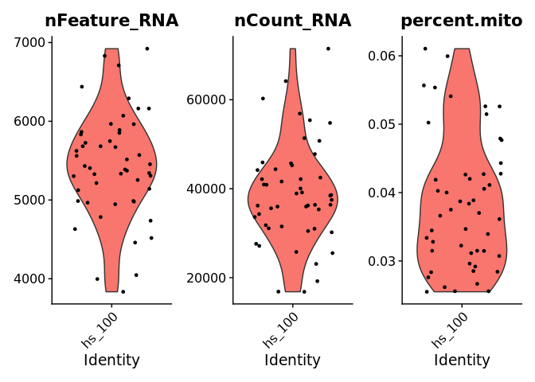

```{r setup, include=FALSE}
options(htmltools.dir.version = FALSE)
```

class: inverse, center, middle

# Technologies<br/>&<br/>Experimental Design

---

# Technologies

.pull-left[
### Covered Domains

- Genomics
- Epigenomics
- Transcriptomics
- Proteomics
]

.pull-right[
### Why Single Cell?

- Heterogeneity: cell type, cell state (spatial and temporal) 
- Rare cells
]

### State-of-the-art

 ([Ren et *al.*, Genome Biology, 2018](https://genomebiology.biomedcentral.com/articles/10.1186/s13059-018-1593-z#citeas))

???

Single cell Sequencing techno have been designed for almost all the molecular layers of genetic information flow from DNA to RNA and proteins.

Epigeno: DNA methylation, chromatin accessibility, chromatin conformation, histone modification

classic NGS measures actually the average across thousands of cells, SC is at cell-to-cell variation

difference between 2 types of cells, 
difference between same cell type but at different time point / state of differentiation (immune cell, early or metastatic stage), or the spatial difference (tumor tissue, cells in center or distal cell)

---

# Experimental Design

- Biological Question?

- Which Technology?

- Sequencing Strategy?
  - Technical variation control: UMI (Unique Molecular Identifier), Spike-ins
  - Sequencing depth
  - Number of cells
  
- Sample Preparation?
  - Collection time
  - Type, *e.g.*: fresh, frozen, FFPE
  - Cells dissection, *e.g.*: manual, laser, high throughput methods

???
each cell is unique, impossible to reproduce the results, need some quality control: 
- **Spkie-in ERCC**: synthetic RNA molecules, used to evaluate yield and capture efficiency (assess amplification artefacts), if high reads of spike-in RNA, indicates the internal RNA quantity is low, which might due to RNA degradation, cell apoptosis, etc. (not recommended with 10X technology)
- **UMI**: monitor the number of molecules, keep the same UMR ratio as the begin => reduce bias due to amplification
Protocol: but also more cells (droplet-based) or more genes (plate-based)? cost? long reads or short reads?

- high throughput: Fluorescence-/magnetic-activated cell sorting, doublet or empty droplet
---

# Experimental Design

### Protocols

  
(Source: lecture 1, K.Lebrigand)

---
class: inverse, center, middle

# From<br/>Raw Base Call (BCL)<br/>To<br/>Count Matrix

---

# Raw Data Processing

### Get FASTQ From BCL Files

- Illumina's [bcl2fastq](https://emea.support.illumina.com/sequencing/sequencing_software/bcl2fastq-conversion-software.html) (need to format sample index if applied on 10X data)
- 10X's [cellranger mkfastq](https://support.10xgenomics.com/single-cell-gene-expression/software/pipelines/latest/using/mkfastq)
  ```sh 
      ├── SINCELLTE  ## Project dir
  * │   └── SCsample1  ## Sample dir
  * │       ├── SCsample1_S1_L001_I1_001.fastq.gz  ## Sample index
  * │       ├── SCsample1_S1_L001_R1_001.fastq.gz  ## R1 = BC + UMI
  * │       └── SCsample1_S1_L001_R2_001.fastq.gz  ## R2 = RNA
      │── Reports  ## QC and operation report
      │   └── html
      │       └── SINCELLTE
      ├── Stats  ## Stats on processing
      │   ├── AdapterTrimming.txt
      │   ├── ConversionStats.xml
      │   ├── DemultiplexingStats.xml
      │   ├── DemuxSummaryF1L1.txt
      │   ├── FastqSummaryF1L1.txt
      │   └── Stats.json
      ├── Undetermined_S0_L001_I1_001.fastq.gz  ## failed to get attributed
      ├── Undetermined_S0_L001_R1_001.fastq.gz  ## Same for R1
      └── Undetermined_S0_L001_R2_001.fastq.gz  ## Same for R2
  ```
  
---

# Raw Data Processing

### Check Quality Of Reads

- [FastQC](https://www.bioinformatics.babraham.ac.uk/projects/fastqc/): basic QC on reads

- [FastQC Screen](https://www.bioinformatics.babraham.ac.uk/projects/fastq_screen/): identify cross-species contamination by performing quick mapping
  
- [NGSCheckMate](https://github.com/parklab/NGSCheckMate): check sample relatedness (*e.g.*: family, trio, *etc.*), based on samples' variant allele fraction correlation calculated from a known list of SNPs
  
- [Xenome](https://github.com/data61/gossamer/blob/master/docs/xenome.md): extract reads from the expected genome (attention: should be only applied on reads in **R2** files, and need to resync R1 with the remaining reads)

- [fastp](https://github.com/OpenGene/fastp): trim bad quality reads (again, only applied on **R2** files and resync the R1 files)

???
Xenome: in case of transplant or FastQC screen detect contamination

---

# Raw Data Processing

### Get Count Matrices

- [cellranger count](https://support.10xgenomics.com/single-cell-gene-expression/software/pipelines/latest/what-is-cell-ranger), takes FASTQ files to perform alignment, with built-in reference packages (*e.g.*: hg19, hg38)

  ```sh
      outs ## truncated list of files
      ├── pbmc_1k_protein_v3_web_summary.html 
      ├── raw_matrix
      │   ├── barcodes.tsv.gz
      │   ├── features.tsv.gz
      │   └── matrix.mtx.gz
  * ├── filtered_matrix 
  * │   ├── barcodes.tsv.gz 
  * │   ├── features.tsv.gz
  * │   └── matrix.mtx.gz
      ├── pbmc_1k_protein_v3_GTF_rdx.bam
      ├── pbmc_1k_protein_v3_GTF_rdx.bam.bai
      ├── pbmc_1k_protein_v3_feature_ref.csv
      ├── pbmc_1k_protein_v3_feature_ref.fa
      └── analysis
          ├── clustering
          ├── pca
          └── tsne
  ```

???

Genome Alignment => Mapping Quality Adjustment => Transcriptome Alignment => 
  Barcode Filtering & Correction => UMI Filtering, Correction & Aggregation => Barcode Selection

Exonic reads will be conserved using a certain cut-off of mapping value
All reads mapped to exonic region are re-aligned to transcriptome
barcode selection: remove ambient RNA from cells already dead, which released their RNA in the droplet
(the "kneeplot" to identify the primary mode of high RNA content cells)

- An HTML summary
- The count matrices, in two versions :
  - "raw" : containing all possible barcodes
  - "filtered" : containing barcodes filtered as cell-containing
- The count matrices, in two different formats (both can be read in R and python):
  - uncompressed hierarchical dataframes (HDF5, extension *.h5)
  - gzip-compressed "MEX" (Market Exchange) files (binary sparse matrix)
- The sorted genomic alignment BAM made with STAR, and its index (BAI)
- Molecule information files in HDF5 : contains information for all molecules that contain a valid barcode and valid UMI and were assigned with high confidence to a gene or Feature Barcode.
- Secondary analysis (PCA, tSNE, clustering, differential analysis) results in CSV tables.
- Loupe browser file: a file (*.cloupe) that can be opened in the Loupe Browser that allows dynamic exploration of the secondary analysis results.

Barcode allow for linking of each gene to its cell of origin

UMI allows for counting gene transcripts expressed in each cell

---
class: inverse, center, middle

# Quality Control<br/>&<br/>Normalization<br/>&<br/>Batch Effect

---

# Quality Control

- Number of cells/sample detected

- Filter poor quality cells
  - Number of genes/cell detected
  - Number of UMIs/cell detected
  - % of mitochondrial genes

- Remove doublets: [doubletFinder](https://github.com/chris-mcginnis-ucsf/DoubletFinder), [Scrublet](https://github.com/AllonKleinLab/scrublet) (Python)

- Remove background noise due to ambient mRNAs: [SoupX](https://github.com/constantAmateur/SoupX)

???
**cells/sample** taking into account techno used (% capture), comparable with preparation?

**UMIs/cell** to low => sequencing depth not enough
**genes/cell** distribution ? bimodal or one large peak, biologically different types of cells, cell size, or tech error
strong correlation between UMIs/cell and genes/cell

have an idea of your expectations for the cell types prior to performing the QC, eg: expected to have low complexity cells? cells with high mito gene expression ?

high % mito gene: bad sample quality due to apoptotic or lysing cells, but it can also be the real feature of particular sample like tumor biopsies

doublets: due to errors in cell sorting, can incorrectly suggest the existence of intermediate cell populations or transitory states

**doubletFinder**: uses gene expression feature to predict doublets, create artificial doublets by averaging the transcriptional profile of randomly chosen cell pairs

**SoupX**: remove contribution of cell free mRNA and recover the true abundance of each gene in each cell. Estimate the ambient RNA from empty droplets; set contamination fraction of UMI from background in each cell; correct the expression

---

# Quality Control

```{r eval=FALSE}
library(Seurat)
exp_mat <- Read10X(data.dir = "/path/to/filtered_matrix")

## Create a Seurat object from a feature expression matrix
exp_mat <- CreateSeuratObject(
  counts = exp_mat,
  project = "hs_100",
  assay = "RNA",
  min.cells = 3, #<<
  min.features = 100, #<<
  names.field = 1,
  names.delim = "_",
  meta.data = NULL
)

## To access raw counts
exp_mat@assays$RNA@counts ## or directly by
GetAssayData(exp_mat, slot = "counts")[1:3, 1:10]
## 3 x 10 sparse Matrix of class "dgCMatrix"
##                                     
## AP006222.2  1 . . . . . . . 1 .
## FAM41C      . . . . . . . . . .
## NOC2L       3 . . 2 . 3 5 . 8 .
```

???
**min.cells = 3** Include features detected in at least this many cells

**min.features = 100** Include cells where at least this many features are detected

counts are stored in "assays", raw and normalized counts

slotNames(exp_mat)

[1] "assays"       "meta.data"    "active.assay" "active.ident" "graphs"  
[6] "neighbors"    "reductions"   "images"       "project.name" "misc"     
[11] "version"      "commands"     "tools"

---

# Quality Control

```{r eval=FALSE}
## QC metrics are stored in metadata
## Add % mito to metadata
exp_mat[["percent.mt"]] <- PercentageFeatureSet(
  object = exp_mat, pattern = "^MT-"
)

head(exp_mat@meta.data)
##                    orig.ident nCount_RNA nFeature_RNA  percent.mt
## AAAGATGAGAAACGAG-1     hs_100      27144         5125 0.022184300
## AACCATGGTCAGAAGC-1     hs_100       4288         1558 0.018880000
## AACTCCCTCCCAGGTG-1     hs_100        125          108 0.014776925
## AACTCTTGTTCTGAAC-1     hs_100      37486         5307 0.000742153
## AAGCCGCTCCCAGGTG-1     hs_100        227          183 0.036745407
## AAGTCTGAGGACGAAA-1     hs_100       4018         1477 0.020592667

```

???
flexible to add any QC stats in metadata, then can be subset by built criteria in metadata

---

# Quality Control

.pull-left[
```{r eval=FALSE}
## Visualize QC metrics
VlnPlot(
  object = exp_mat, 
  features = c(
    "nFeature_RNA", 
    "nCount_RNA", 
    "percent.mt"
  )
)

## Filter poor quality cells
exp_mat <- subset(
  x = exp_mat, 
  subset = (nFeature_RNA > 3000) & #<<
    (nCount_RNA > 10000) & #<<
    (percent.mito > 0.01) & #<<
    (percent.mito < 0.2) #<<
)
```
]

.pull-right[
Before  


After  


(Source: lecture 6, A.Paquet)
]

---

# Normalization

### Global Scaling

Hypothesis: cells are homogeneous in RNA content (not always verified)

=> Scaling factor: median UMI count or 10,000 in [Seurat](https://satijalab.org/seurat/) and [Cell Ranger](https://support.10xgenomics.com/single-cell-gene-expression/software/pipelines/latest/what-is-cell-ranger)

```{r eval=FALSE, include=FALSE}
exp_mat <- NormalizeData(
  object = exp_mat, 
  normalization.method = "LogNormalize", 
  scale.factor = round(median(exp_mat$nCount_RNA)) ## by median UMI counts
)
```

### scRNA-seq Specfic Scaling

Zero-inflation in single-cell data while a lots of genes expressions are low, methods based on per-gene statistics (upper quartile, edgeR TMM, DESeq2 size factors) will be off

=> Estimation of cell-specific size factors using deconvolution: implemented in [scater](https://bioconductor.org/packages/release/bioc/html/scater.html), [scran](https://www.bioconductor.org/packages/release/bioc/html/scran.html)

### Other Methods

- Variance Stabilization
- Normalization based on spike-ins or housekeeping genes
- *etc.*

???
Violence of hypo of global scaling: cell with different size, **mRNA content abundance**, or difference in sequencing **depth** within the cell

most normalization methods based on per-gene statistics (upper quartile,  TMM, trimmed mean Mvalue, DESEq2 size factors), will be off
TMM: Samples/observations that have the closest average expressions to mean of all samples is considered as reference samples

**deconvolution**  to calculate the per-cell normalization factors. 1) pool counts from many cells to increase the size of counts, like preclustering with PCA; 2) pool-based size factors are then deconvoluted into cell-based factors for normalization of each cell's expression profile

---

# Batch Effect

Data integration methods<sup>1</sup>, *e.g.*:

.pull-left[
- ComBat: [sva](http://bioconductor.org/packages/release/bioc/html/sva.html)

- Canonical correlation analysis: [Seurat](https://satijalab.org/seurat/)

- Projects cells into a shared embedding: [Harmony](https://github.com/immunogenomics/harmony)


]

.pull-left[
- Mutual Nearest Neighbors (MNN): [batchelor](https://bioconductor.org/packages/3.11/bioc/html/batchelor.html)


]

.footnote[
[1] A benchmark of batch-effect correction methods for single-cell RNA sequencing data, [Tran *et al.*, 2020](https://www.ncbi.nlm.nih.gov/pmc/articles/PMC6964114/)
]

???
when: samples are processed under **different technologies or times**
either include tech as a variable in stat model, or use correct the batch effect using data integration methods.

**comBat** Bayesian frame work with known tech variable

**canonical correlation analysis** for all datasets, normalize -> find most variable -> scale -> runPCA -> runTSNE on PCs -> find nearest neighbor -> find cluster. Then find anchors between sets, pass these anchors to integrate data

**Harmony** first PCA, soft assign cluster, then in each iteration, it clusters similar cells from diff batches while maximizing the diversity of batches within each cluster and then calculates a correction factor for each cell to be applied.

**MNN** variant de KNN, based on **Euclidean distance**, for each cell in set1, identified the k2 nearest cells in set2, same for each cell in set2. Two cells in diff batches are considered to be MNNs if each cell is in the other's set

---
class: inverse, center, middle

# Dimension Reduction<br/>&<br/>Clustering

---

# Dimension Reduction

.pull-left[
### Feature Extraction

- Filter low expressed genes, *e.g.*: < x% of cells, average < threshold
- Highly variable genes (coefficient of variation $C_V=\sigma/\mu$)
- Highly correlated genes (Spearman's rho)

###  Dimension Reduction

- PCA: linear method
- tSNE (t-Distributed Stochastic Neighbor Embedding)
- UMAP (Uniform Manifold Approximation and Projection)
- *etc.*
]

.pull-right[
```{r eval=FALSE}
exp_mat <- FindVariableFeatures(
  object = exp_mat, 
  selection.method = "vst",
  nfeatures = 2000
)
exp_mat <- ScaleData(exp_mat)
exp_mat <- RunPCA(exp_mat)
print(exp_mat[["pca"]], dims = 1:2, nfeatures = 5)
## PC_ 1 
## Positive:  CST3, TYROBP, LST1, AIF1, FTL 
## Negative:  MALAT1, LTB, IL32, IL7R, CD2 
## PC_ 2 
## Positive:  CD79A, MS4A1, TCL1A, HLA-DQA1, HLA-DQB1 
## Negative:  NKG7, PRF1, CST7, GZMB, GZMA 

ElbowPlot(exp_mat) ## determine how many PCs will based on in following steps

exp_mat <- RunTSNE(object = exp_mat, dims = 1:10)
exp_mat <- RunUMAP(object = exp_mat, dims = 1:10)
```

]

???
high correlated, can avoid HVG caused by random noise

**vst** fit a line to the relationship of log(variance) and log(mean) using local polynomial regression (loess), normalize feature value by the fitted lines, the calculate the variance on standardized values

**SNE**: transform the euclidean distance -> the conditional probablity of 2 points be together, then minimize the prob in high dim and in low dim. perplexity -> nb of active neighbors, small, more clusters. preseve local structure
tsne preserve local structure.

**UMAP** constructs a high dimensional graph representation of the data then optimizes a low-dimensional graph to be as structurally similar as possible. UMAP is faster and can better preserve global structure than tSNE. params: n_neighbor, min_dist
https://pair-code.github.io/understanding-umap/

---

# Clustering

*E.g.*: K-means based, hierarchical clustering, KNN-based, graph-based clustering

.pull-left[
```{r eval=FALSE}
## Example of KNN-based
exp_mat <- FindNeighbors(
  object = exp_mat, 
  reduction = "pca", 
  dims = 1:10
)
exp_mat <- FindClusters(
  object = exp_mat, 
* resolution = 0.8 
  ## higher resolution = more clusters
) 

## To access clusters
head(Idents(exp_mat), 3)
## AAACATACAACCAC AAACATTGAGCTAC AAACATTGATCAGC
##              1              3              1
## Levels: 0 1 2 3 4 5 6 7 8
```
]
.pull-left[
```{r eval=FALSE}
DimPlot(exp_mat, reduction = "umap")
```


(Source: Seurat Guided tutorial - 2,700 PBMCs )
]


???
KNN: supervised, with known label, it's a regression

**FindNeighbor**s: construct a KNN graph based on the euclidean distance in PCA space, and refine the edge weights between any two cells based on the shared overlap in their local neighborhoods

**FindClusters**: To cluster the cells, we next apply modularity optimization techniques such as the Louvain algorithm (default) or SLM

A systematic performance evaluation of clustering methods for single cell RNA seq data. [Duò A, Robinson MD and Soneson C., 2018](https://f1000research.com/articles/7-1141)

---
class: inverse, center, middle

# Cell Type Annotation

---

# Cell Type Annotation

.pull-left[
- Manual ways: 
  - prior knowledge in literature
  - public database like [panglaoDB](https://panglaodb.se/index.html) (human and mouse) or [scRNAseq](http://bioconductor.org/packages/release/data/experiment/html/scRNAseq.html) (Bioconductor)
  - ask your biologist ;)

- Label transferring: predict unknown samples using reference by checking the similarity (in Seurat: `FindTransferAnchor` + `TransferData`, other R packages: [CHETAH](http://www.bioconductor.org/packages/release/bioc/html/CHETAH.html), [SingleR](https://www.bioconductor.org/packages/release/bioc/html/SingleR.html), *etc.*)
]

.pull-right[
```{r eval=FALSE}
# find all markers of cluster 1
cluster1.markers <- FindMarkers(
  object = exp_mat, ident.1 = 1
)
```


(Source: lecture 7, A.Cortal)
]

???
eg: populations de cellules immunitaires

---
class: inverse, center, middle

# Differential Expression Analysis

---

# Differential Expression Analysis

- [SCDE](https://hms-dbmi.github.io/scde/): Bayesian method to compare two groups of single cells
- [MAST](https://www.bioconductor.org/packages/release/bioc/html/MAST.html): adapted generalized linear model for bimodal and/or zero-inflated single cell data
- Wilcoxon Rank Sum test
- Student's t-test
- *etc.*

```{r eval=FALSE}
# Find DE markers for each found cluster
up_markers <- FindAllMarkers(
  object = exp_mat, 
  test.use = "wilcox",
  only.pos = TRUE, ## chekc only up-regulated genes
  min.pct = 0.1, ## filter genes expressed in few cells
  logfc.threshold = 0.5
)
```

---
class: inverse, center, middle

# Example Workflow

---

# Example Workflow

Some complete analysis pipelines: 
[Seurat](https://satijalab.org/seurat/), 
[Scater](https://bioconductor.org/packages/release/bioc/html/scater.html) (Bioconductor),
[Scran](https://www.bioconductor.org/packages/release/bioc/html/scran.html) (Bioconductor), 
[SCANPY](https://scanpy.readthedocs.io/en/stable/)(Python)

Seurat Standard Workflow:

```{r eval=FALSE}
library(Seurat)
exp_mat <- Read10X(data.dir = "path/to/dir_matrices")
exp_mat <- CreateSeuratObject(counts = exp_mat)
exp_mat <- NormalizeData(object = exp_mat)
exp_mat <- FindVariableFeatures(object = exp_mat)
exp_mat <- ScaleData(object = exp_mat)
exp_mat <- RunPCA(object = exp_mat)
exp_mat <- FindNeighbors(object = exp_mat)
exp_mat <- FindClusters(object = exp_mat)
exp_mat <- RunTSNE(object = exp_mat)
DimPlot(object = exp_mat, reduction = "tsne")
```


---
class: inverse, center, middle

# Further Analyses

---
# Further Analyses

.pull-left[
### Functionnal Analysis

- Based on MCA (multiple correspondence analysis): [CellID](https://github.com/RausellLab/CelliD)

### Trajectory Analysis

- [ElPiGraph](https://github.com/sysbio-curie/ElPiGraph.R)
- [STREAM](https://github.com/pinellolab/STREAM) (Single-cell Trajectories Reconstruction, Exploration And Mapping)
]
.pull-right[
### Integration multi-omics

Compensate for missing or unreliable information present in each omics.

Integration methods: 

- Transfer learning: [Signac](https://satijalab.org/signac/)
- Matrix factorization: [LIGER](https://macoskolab.github.io/liger/)


(Source: lecture 13, L.Cantini)
]

???
*e.g.*: scATAC-seq (Chromatin accessibility) + scRNA-seq, side proof

**CellID**: rank genes by their distance to each cell, then perform over representation test
**LIGER**: shared genes and dataset specific genes

---

# Some Readings

- Workshop slides: 
https://cloud.biologie.ens.fr/index.php/s/RXkNGwtR1MLf5mo

- AlJanahi, Aisha A et al. “An Introduction to the Analysis of Single-Cell RNA-Sequencing Data.” Molecular therapy. Methods & clinical development vol. 10 189-196. 2 Aug. 2018, doi:10.1016/j.omtm.2018.07.003

- Introduction to Single-cell RNA-seq: https://hbctraining.github.io/scRNA-seq/

- Seurat guided analyses: 
https://satijalab.org/seurat/vignettes.html

- Orchestrating Single-Cell Analysis with Bioconductor: https://osca.bioconductor.org/index.html

---
background-image: url(libs/roscoff_pontoon.jpeg)
background-size: cover
class: center, bottom, inverse

# Thank You
